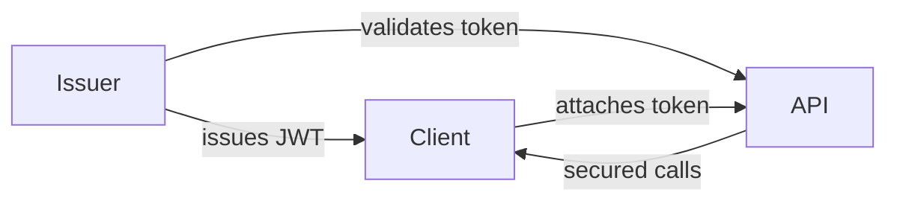
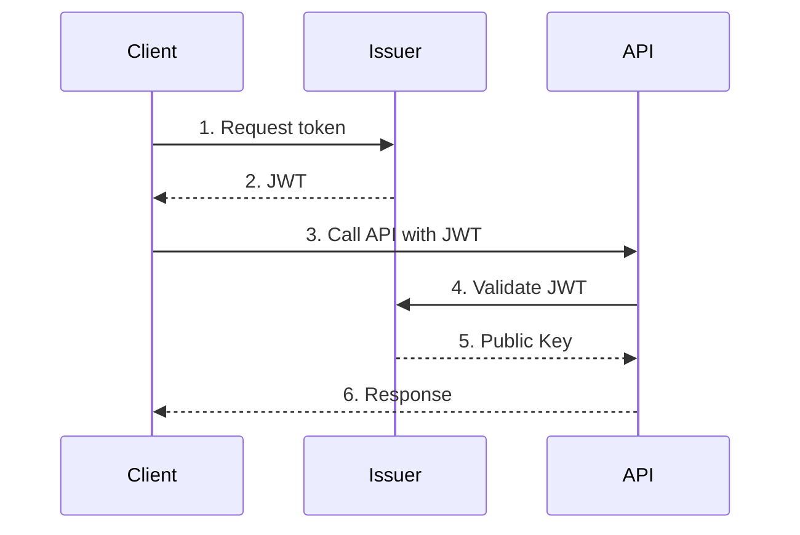

# Web API Suite

A **.NET 10 Web API solution** showcasing secure authentication, containerization, and contributor‑friendly workflows.  
The suite includes an Issuer for token generation, an API protected by those tokens, and a sample Client for integration testing.

---

## ✨ Highlights

- **Issuer service** – Issues JWTs with configurable lifetimes and signing keys.
- **API service** – Exposes endpoints secured by Issuer‑issued tokens.
- **Client app** – Demonstrates token acquisition and API consumption.
- **Certificate automation** – POSIX + PowerShell routines for HTTPS and signing.
- **Security key generation** – Automated RSA keypair creation for token issuance.
- **Docker support** – Multi‑stage builds with reproducible onboarding.
- **Cross‑IDE profiles** – Debug configurations for Visual Studio and VS Code.

---

## ⚙️ Prerequisites

- **.NET 10 SDK**
- **OpenSSL available in PATH**
- **Docker Desktop** (optional, for container builds)
- **Visual Studio 2026 or VS Code** with the C# extension

---

## 🔧 Usage

All setup and deployment scripts live in `./local`, with both POSIX and PowerShell variants available.

The docker project lives in `./docker`, it can be deployed using `make` commands.

### Setup development runtime

```powershell
./ensure-runtime.ps1
```

This sets up all required resources for runtime. Unless hosting certificates, signing keys and/or passwords need to be rotated, this is enough for a start.

### Generate HTTPS certificates

```powershell
./generate-hosting-cert.ps1
./generate-hosting-cert.ps1 -Mode API
./generate-hosting-cert.ps1 -Mode ISSUER
```

### Generate signing keys

```powershell
./generate-security-keys.ps1
./generate-security-keys.ps1 -Mode CLIENT
./generate-security-keys.ps1 -Mode ISSUER
```

After generating the client keys, please run `provision.ps1` to ensure the public key is correctly deployed.

### Provision data

```powershell
./provision.ps1 -Mode API
./provision.ps1 -Mode ISSUER
```

This supports both Postgres and JSON file-based data store.

### Run docker

File-based data store:

```sh
./make json-init
```

Postgres data store:

```sh
./make postgres-init
```

Reset:

```sh
./make nuke
```

There are a number of other commands, to list them, run:

```sh
./make
```

---

## 🔐 Trust Flow Diagram



---

## 📈 Token Request & Validation (Sequence)



**Step‑by‑step:**

1. Client requests a token from the Issuer.
2. Issuer signs a JWT using its private key.
3. Client calls the API with the JWT in the Authorization header.
4. API validates the token using the Issuer’s public key.
5. API returns secured data if validation succeeds.

---

## 🧪 Testing & Development

- **Certificates and keys** live in each project’s `runtime/secrets/`.
- **Mock data** lives in each project’s `runtime/data/`.
- **Token issuance and API calls** can be tested with `curl`, Postman, or any HTTP client.

---

## 📌 Notes

- **Scripts are atomic and rollback‑safe** to ensure clean onboarding.
- Maintain repo hygiene by keeping `LICENSE`, `SECURITY.md`, and `README.md` aligned.
