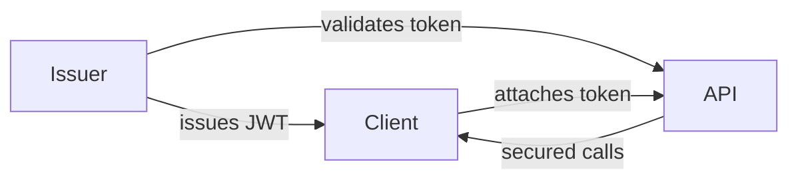
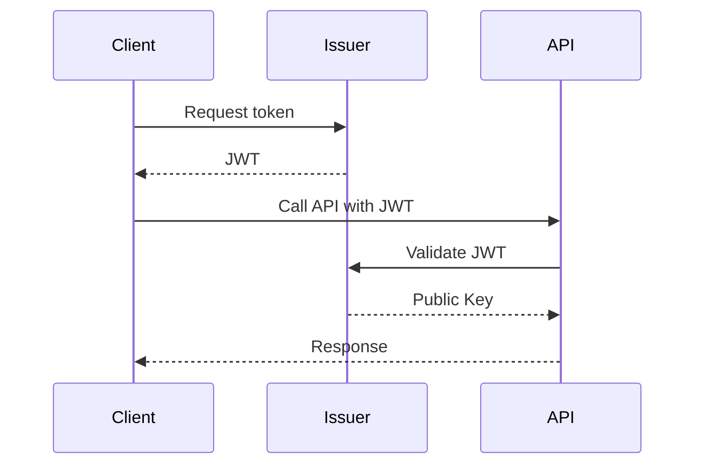

# Web API Suite

A **.NET 10 Web API solution** demonstrating secure authentication, containerization, and contributor‑friendly workflows. The suite includes an Issuer service for token generation, an API service protected by those tokens, and a sample Client for integration testing.

---

## ✨ Highlights

- **Issuer service** – Issues JWT tokens with configurable lifetimes and signing keys.
- **API service** – Exposes endpoints secured via Issuer‑issued tokens.
- **Client app** – Demonstrates token acquisition and API consumption.
- **Certificate automation** – PowerShell and POSIX‑compliant routines for HTTPS and signing.
- **Security key generation** – Automated scripts to create signing keys for token issuance.
- **Docker support** – Multi‑stage builds with guardrails for onboarding and reproducibility.
- **Cross‑IDE profiles** – Debugging and launch settings for Visual Studio and VS Code.

---

## ⚙️ Prerequisites

- **.NET 10 SDK**
- **OpenSSL in PATH**
- **Docker Desktop** (optional, for container builds)
- **Visual Studio 2026 or VS Code** with C# extension

---

## 🔧 Usage

Folder `.\src\setup` contains required assets and setup scripts for project development. Both POSIX and PowerShell versions are included.

- **Setup development assets**

  ```powershell
  ./ensure-assets.ps1
  ```

- **Generate HTTPS certificates**

  ```powershell
  ./generate-cert.ps1 -Mode API
  ./generate-cert.ps1 -Mode ISSUER
  ```

- **Generate signing keys**

  ```powershell
  ./generate-keys.ps1 -Mode CLIENT -ClientId <GUID>
  ./generate-keys.ps1 -Mode ISSUER
  ```

- **Reset seeded data**
  ```powershell
  ./reset-data.ps1 -Mode API
  ./reset-data.ps1 -Mode ISSUER
  ```

---

## 🔐 Trust Flow Diagram



---

## 📈 Sequence Diagram (Token Request & Validation)



**Step‑by‑step:**

1. Client requests a token from Issuer.
2. Issuer generates a JWT using its private signing key.
3. Client calls the API with the JWT in the Authorization header.
4. API validates the JWT using the Issuer's public key.
5. API returns secured data if validation succeeds.

---

## 🧪 Testing & Development

- **Certificates and keys** are located in each project's `assets/https/` or `assets/signing/` folder.
- **Mock data** are located in each project's `assets/data/` folder.
- **Token issuance and API calls** can be verified using `curl`, Postman, or any standard HTTP client.

---

## 📌 Notes

- **Scripts are atomic and rollback‑safe** to ensure clean onboarding.
- **Repo hygiene**: keep `LICENSE`, `SECURITY.md`, and `README.md` aligned.
